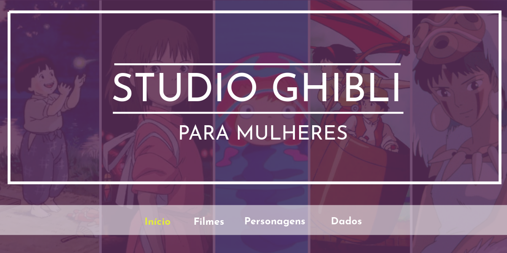
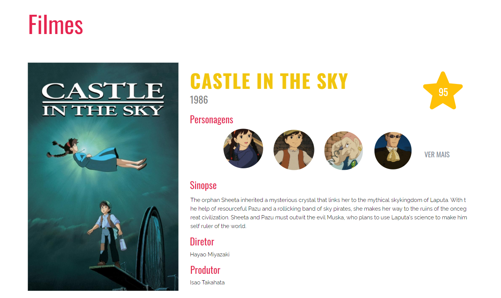
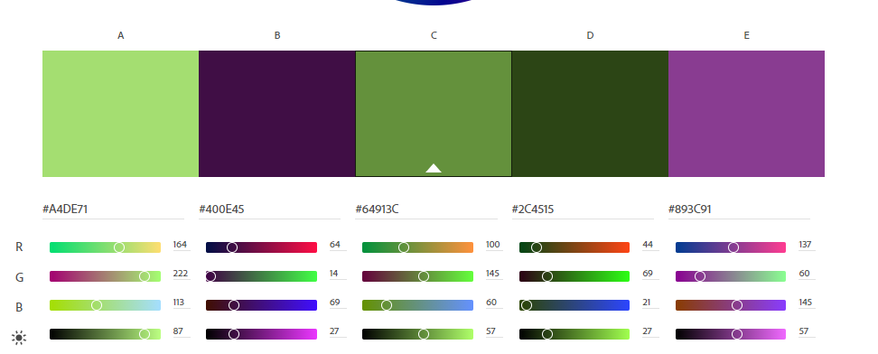

# Studio Ghibli - Quebrando paradigmas

## Índice

- [1. Introdução ao Projeto](#1-introdução-ao-projeto)
- [2. Histórias de Usuários](#2-histórias-de-usuários)
- [3. Desenvolvimento da Interface](#3-desenvolvimento-da-interface)
- [4. Testes de Usabilidade](#4-testes-de-usabilidade)
- [5. Conteúdos implementados no projeto](#5-conteúdos-implementados-no-projeto)

---

## 1. Introdução ao Projeto

O objetivo deste projeto é construir uma página web para visualizar um conjunto de dados que se adapte às necessidades do usuário. Essa página possibilita tanto visualizar como filtrar, ordenar os dados e mostrar informações relevantes através de cálculos agregados e gŕaficos.

A escolha do tema para o projeto foi o Studio Ghibli.

Studio Ghibli é um estúdio japonês de animação, muito conhecido por seus filmes como **Meu Amigo Totoro**, **A Viagem de Chihiro**, **O Castelo Animado**, entre outros grandes sucessos.
As animações são bem recebidas em todo o mundo e algumas receberam várias nomeações e prêmios. De todo esse fandom há um grupo que deseja interagir e ver as informações das animações e seus personagens.

A partir dessa proposta definimos que o site seria dividido em 4 páginas:

- **Pagina Inicial** - Traz informações sobre o estúdio de animação, que aborda em seus filmes temas relevantes e importantes para a sociedade. 
- **Página de filmes** - Possibilita a visualização de todos os filmes do estúdio com detalhes sobre cada um. Os filmes podem ser filtrados por diretor e produtor e ordenados por ordem alfabética, data de lançamento e nota de avaliação.
- **Página de Personagens** - Apresenta cards com todos os personagens que podem ser filtrados por filme e por gênero.
- **Página de Dados** - Mostra um dashboard com o total de filmes, média das notas de avaliação, graficos com notas por filme e linha do tempo.

## 2. Histórias de Usuários

Uma História de Usuário representa em linguagem simples o que o usuário faz, do que ele precisa e por que, de maneira concisa. As histórias para esse projeto foram escritas pensando nas necessidades de nosso usuário final. A medida que o projeto avançava, algumas histórias foram subdivididas, tendo como objetivo organizar melhor as tarefas e atender aos requisitos da aplicação.

Algumas das averiguações levadas em consideração para o desenvolvimento destas histórias são:

- Studio Ghibli tem várias animações e para nossos usuários é importante
saber quantas e quais são
- As mentes por trás de cada animação são os diretores e produtores,
sendo que eles podem ter contribuído na criação de mais de uma obra. Portanto, é importante
para nosso usuário poder conhecê-los e saber quantas e quais são as criações
em que eles trabalharam
- As animações possuem informações relevantes para nossos usuários, como
descrição, data de lançamento, diretor, produtor e personagens
- Cada animação tem seus personagens e para nossos usuários é importante
saber quantos e quais são
- Os personagens têm características únicas que o usuário deseja conhecer, como
nome, idade, sexo, espécie, etc.

  |   |   

  |   |   

## 3. Desenvolvimento da Interface

Após a primeira análise dos dados disponíveis, percebemos que o site contaria com com cards de filmes e personagens que seriam filtrados e ordenados. A partir desta primeira ideia foi definido o protótipo de baixa fidelidade:

 | 

Posteriormente foi decidido dividir os conteúdos em páginas diferentes. Por esse motivo o layout mudou no protótipo de alta fidelidade:

Analisando os dados e pensando em abordar a Representatividade Feminina sempre retratada pelo Studio Ghibli em seus filmes, pensamos em trazer os dados para expor esse tema. Em um segundo momento através dos testes de usabilidade, foi constatado pelos usuários que os dados disponíveis não eram específicos e relevantes para esse tema específico. Por este motivo optamos por modificar o título do filme no decorrer do projeto.

A página de filmes contém informações e detalhes sobre cada animação.

A paleta de cores utilizada priorizou as cores verde e roxo, com ilustrações de personagens dos filmes.

O layout da pagina é responsivo e focado em legibilidade com design minimalista e otimizado para dispositivos mobile.

## 4. Testes de usabilidade

  Nos testes de usabilidade, fizemos a observação de pessoas de nosso público alvo consumindo a aplicação e detectamos quais mudanças seriam necessárias para melhoria da experiência do usuário. Além disso recebemos o feedback e sugestões desses participantes do que atendia às suas necessidades e do que precisava ser melhorado.

  Alguns dos pontos analisados foram os seguintes:
  - O acesso às páginas é fácil e intuitivo?
  - Os filtros e ferramentas de cada página são de fácil acesso e utilização?
  - As informações sobre cada filmes são claras, de fácil leitura e suficientes? O que achou das dimensões de cada tópico e informações?
  - Os filtros de filmes correspondem às necessidades?
  - Os cards de personagens são de utilização fácil e intuitiva? As informações estão claras?
  - O tamanho dos cards atende às suas expectativas? Você colocaria mais ou menos cards dispostos na mesma linha?
  - Os dados do estúdio são úteis pra você? Eles estão claros? Existem outros dados que você tenha interesse em fazer?

Algumas das soluções implementadas para solucionar os problemas detectados nos testes de usabilidade:

### Tratar erro de carregamento de imagens

Fizemos a substituição dinâmica das imagens que não carregavam por uma imagem padrão para informar ao usuário que elas estão indisponíveis, não comprometendo o layout das páginas de filmes e personagens. Utilizamos métodos de requisição HTTP para verificar os erros e substituir as imagens.
### Tradução de conteúdos para o português

Na utilização da página filmes, os usuários questionaram a disponibilização de informações importantes, como as sinopses dos filmes, somente na língua inglesa, o que poderia prejudicar o entendimento de seu conteúdo. 

Como alternativa, implementamos a ferramenta de tradução da página para português ou inglês, com a ferramenta Google Translate.

### Abrir poster dos filmes para mobile

 Nos testes em dispositivos mobile, os usuários intuitivamente clicavam no poster dos filmes com a intenção de ampliá-los, já que seu tamanho era reduzido. Por isso, possibilitamos que essas imagens fossem aumentadas com o clique, para serem visualizadas melhor.

### Ampliação do nicho de usuários

A princípio, a aplicação seria direcionada ao público feminino, tendo em vista que os filmes do estúdio abordam temas relevantes para o gênero e grande parte dos fãs são mulheres. Porém, com o feedback dos usuários, identificamos que não era interessante restringir desse modo o público-alvo, já que não era justificável pelos dados e informações que estavamos disponibilizando no site, uma vez que eles poderiam ser de interesse de fãs do gênero masculino ou feminino.

##  5. Conteúdos implementados no projeto

O objetivo principal deste projeto é que aprenda a desenhar e construir uma interface web onde se possa visualizar e manipular dados, entendendo o que o usuário necessita.

Em outras palavras, você aprenderá a:

### HTML e CSS

- [Uso de HTML semântico.](https://developer.mozilla.org/en-US/docs/Glossary/Semantics#Semantics_in_HTML)
- Uso de seletores de CSS.
- Construir sua aplicação respeitando o desenho realizado (protótipo).
- [Uso de flexbox em CSS.](https://css-tricks.com/snippets/css/a-guide-to-flexbox/)

### DOM e Web APIs

- Uso de seletores de DOM.
- Gerenciamento de eventos de DOM.
- [Manipulação dinâmica de DOM.](https://developer.mozilla.org/pt-BR/docs/DOM/Referencia_do_DOM/Introdu%C3%A7%C3%A3o) (appendChild |createElement | createTextNode| innerHTML | textContent | etc.)

### JavaScript

- Uso de condicionais (if-else | switch | operador ternário)
- Uso de laços (for | for..in | for..of | while)
- Uso de funções (parâmetros | argumentos | valor de retorno)
- Manipular arrays (filter | map | sort | reduce)
- Manipular objects (key | value)
- Uso ES modules ([`import`](https://developer.mozilla.org/en-US/docs/Web/JavaScript/Reference/Statements/import) | [`export`](https://developer.mozilla.org/en-US/docs/Web/JavaScript/Reference/Statements/export))
- Diferenciar entre expression e statements.
- Diferenciar entre tipos de dados atômicos e estruturados.

### Testing

- [Teste unitário.](https://jestjs.io/docs/pt-BR/getting-started)

### Estrutura do código e guia de estilo

- Organizar e dividir o código em módulos (Modularização)
- Uso de identificadores descritivos (Nomenclatura | Semântica)
- Uso de linter (ESLINT)

### Git e GitHub

- Uso de comandos de git (add | commit | pull | status | push)
- Gerenciar repositórios de GitHub (clone | fork | gh-pages)
- Colaboração no Github (branches | pull requests | |tags)

